# Attributs de formulaire

## 1. Définition

Les attributs d'un formulaire peuvent être créés, édités et supprimés
dans le studio. Certains attributs exploitent des valeurs issues de base
de données ou de services web, d'autres sont des composants de mise en
page destinés à personnaliser l'interface du formulaire, et d'autres
sont des attributs classiques directement configurables dans vMap.

Il existe plus d'un vingtaine de types d'attributs paramétrables dans la
fenêtre de définition en bas à gauche du studio.

## 2. Édition des attributs

### 2.1. Bouton radio

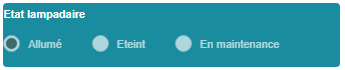

Nommer l'attribut et son libellé tel qu'il sera affiché dans le
formulaire. Définir la valeur par défaut et déterminer si le bouton
radio doit être désactivé ou pas. Définir ensuite les options possibles
en entrant le libellé du bouton et la valeur envoyée en base. Le bouton
"Option" permet l'ajout d'une option supplémentaire.

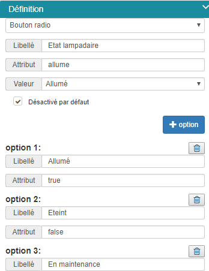

### 2.2. Boîte à cocher

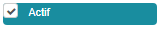

Nommer l'attribut et son libellé tel qu'il sera affiché dans le
formulaire. Définir si la boîte doit être cochée par défaut ou pas.

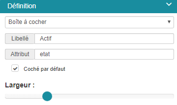

### 2.3. Paramètres de type Carte Bing, OSM, vMap
 vMap permet d'exploiter les services
web OSM, Bing Maps ou Vitis vMap pour personnaliser un formulaire en
exploitant leurs ressources cartographiques.

#### 2.3.1. Carte OSM

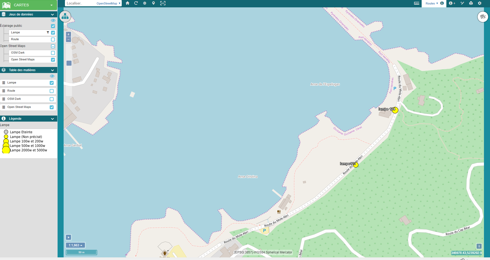

Nommer le paramètre et définir le libellé qui sera affiché dans le
formulaire de demande. Définir la hauteur et la largeur de la carte et
indiquer si ce paramètre est obligatoire ou pas en cochant la case
Requis.

Paramétrer ensuite les options spécifiques aux éléments de type carte :

-   La projection de la carte : WGS84 ou Lambert 93. En Lambert 93,
    l’étendue par défaut correspond à l'ensemble de la
    France métropolitaine.
-   Méthode de centrage de la carte : l'auteur choisit si le centre de
    la carte est défini par un point défini via des coordonnées X/Y et
    une échelle d'affichage, ou si le centre de la carte est
    paramétrée par son étendue définie par les coordonnées X et Y Min
    et Max.

Choisir ensuite les éléments de dessin et de navigation qui seront
affichés sur la carte du formulaire de demande :

-   Position de la souris : affichage dynamique des coordonnées de la
    souris selon la projection définie.
-   Boutons de zoom : affichage des boutons de navigation classique
    zoom avant, zoom arrière et retour à l'étendue par défaut.
-   Echelle : affichage de l'échelle.
-   Projection de la carte : affichage de la projection Lambert 93 ou
    WGS 84.
-   Multiples géométries : possibilité ou pas de saisir des géométries
    de type différent (point, ligne et polygone).
-   Plein écran : permet d'afficher la carte en mode plein écran.
-   Suppression générale : Suppression de toutes les géométries
    saisies sur la carte.
-   Edition : modification de la géométrie sélectionnée.
-   Dessiner un point.
-   Dessiner une ligne.
-   Dessiner un polygone.
-   Le champ Valeur permet à l'auteur de définir une géométrie qui
    sera affichée par défaut dans le formulaire. Cette géométrie est
    décrite via une chaîne WKT :

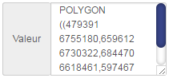

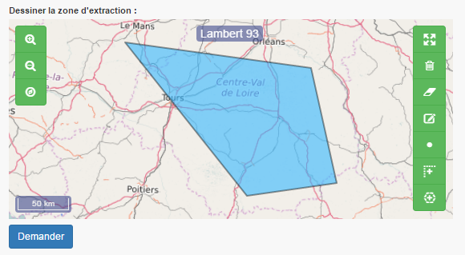

#### 2.3.2. Carte Bing

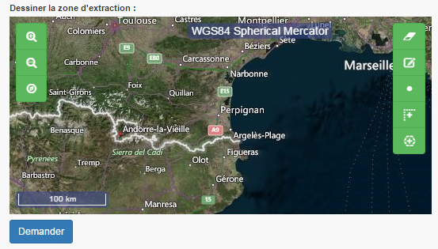

Tous les paramètres de personnalisation d'une carte Bing Maps sont
identiques à ceux des cartes OSM. Il faut fournir en plus, une clé
d'accès pour pouvoir exploiter ce service web cartographique.

Générer une clé Bing Maps sur le site .. :
<https://www.bingmapsportal.com/>

Une fois obtenue, entrer la clé dans le champs Clé et sélectionner la
carte à afficher dans le formulaire de demande :

-   Aerial
-   Aerial WithLabels
-   Road

#### 2.3.3. carte vMap

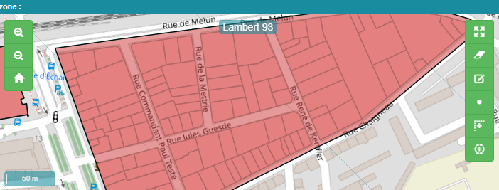

Pour pouvoir exploiter une carte vMap, il faut au préalable, dans vMap,
exporter la définition de la carte.

L'export d'une carte vMap génère un fichier map.json que l'auteur du
formulaire doit télécharger (champ Fichier local) pour pouvoir
l'intégrer dans un formulaire.

Procéder ensuite de la même façon qu'avec les autres ressources de type
carte, en nommant le paramètre et son libellé, puis en paramétrant
l'affichage des outils propres aux cartes.

### 2.6. Champ caché

Un attribut de type Champ caché permet de masquer un attribut. Il est
exploité dans le formulaire mais n'est pas apparent. Nommer le paramètre
et définir la valeur à exploiter. 

### 2.7. Couleur

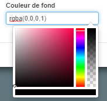

Un attribut de tye Choix de la couleur insère un sélecteur de couleurs.
Nommer le paramètre et le libellé à afficher dans le formulaire, et
définir la couleur par défaut.

### 2.8. Curseur

Un attribut de tye curseur insère un curseur dans le formulaire. Nommer
le paramètre et le libellé à afficher et définir les valeurs minimales
et maximales de la plage de données ainsi que la valeur par défaut.

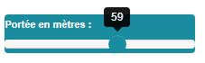

### 2.9. Paramètres de type Date

#### 2.9.1. Date

Un attribut de type Date insère une date sous la forme jj/mm/aaaa. Un
calendrier s'affiche dans le formulaire pour faciliter la date à entrer.

Nommer le paramètre et le libellé à afficher et définir la valeur par
défaut.

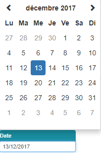

#### 2.9.2. Date/heure

Un attribut de type Date et heure insère une date sous la forme
jj/mm/aaaa hh:mm. Un calendrier et une montre facilite la saisie la date
et de l'heure dans le formulaire.

Nommer le paramètre et le libellé à afficher et définir la valeur par
défaut.

### 2.10. Document - objet métier
Un attribut de type Document - objet métier est un champ de chargement de documents. 

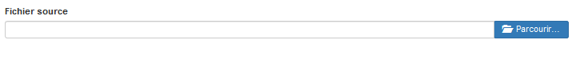

Nommer le paramètre et le libellé à afficher et définir les extensions de documents pouvant être téléchargés. 

Définir le format des documents téléchargeables en indiquant leurs extensions possibles séparées par un |. 

La boîte à cocher "Uniquement en consultation" indique si le document est uniquement consultable ou si il peut être téléchargé. 

 Un unique fichier peut être associé à un attribut. Il faut donc compresser les documents en un unique fichier zip pour pouvoir les associer à un même attribut. 

Obtenir un [exemple d'insertion d'attribut de type Document](cas_utilisation.md)

### 2.12. Décimal
Un attribut de type décimal permet d'insérer dans un formulaire un chiffre décimale. 

### 2.13. Editeur de code CodeMirror

### 2.14. Entier

### 2.15. Grille objet métier

### 2.16. Grille section vitis

### 2.17. Image Objet métier

### 2.18. Image URL

### 2.19. Interface bouton

### 2.20. Interface ligne de séparation

### 2.21. Label

### 2.22. Lien

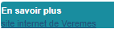

Un attribut de type Lien permet d'insérer des liens vers d'autres
plateformes. Nommer le paramètre et le libellé à afficher.

Définir ensuite les paramètres du lien :

-   Texte : texte à afficher
-   Cible : si laissé vide, la page s'ouvre dans un nouvel onglet.
-   Valeur : adresse du lien

### 2.23. Liste

### 2.24. Texte
