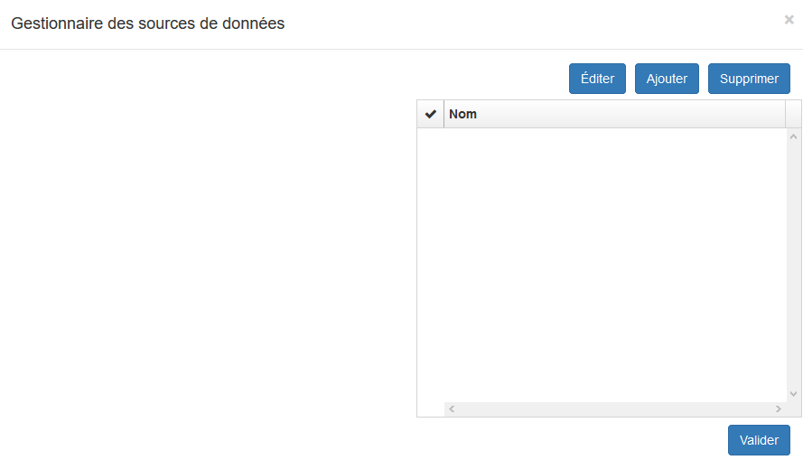

# Le Gestionnaire de source de données

Le gestionnaire de sources de données permet la création, l'édition et la suppression de sources de données à associer à des attributs de type :

-   liste
-   liste déroulante
-   liste double

Le gestionnaire de sources de données permet d'exploiter des données :

-   Texte : valeurs saisies directement dans le gestionnaire
-   Valeur de table locale : valeurs issues d'une table de base de
    données installée sur le serveur
-   Base de données externe : valeurs importées d'une table d'une base
    de données externe
-   Service web Vitis : permet d'exploiter un service web pour en
    récupérer les ressources
-   Objet métier : permet d'exploiter un objet métier déjà configuré

Le bouton **Sources de données**, en bas à droite du studio permet d'ouvrir le gestionnaire de source de données.

Une fois une source de données définie dans le gestionnaire, on peut créer dans le studio,  un attribut de
type "*Liste*" et choisir la source de données mise en place précédemment. 

Une liste est définie par une "*Clé*" qui est la valeur retournée lorsqu'on sélectionne un élément de la liste et d'un "*Libellé*" qui estce que l'utilisateur voit dans la liste dans le formulaire. 

Dans l'exemple ci-dessous, on souhaite sélectionner une route à associer à la lampe en édition. Chaque route est définie par un identifiant numérique (route_id) et elle possède un nom textuel (nom) : on sélectionne "*nom*" en tant que libellé et "*route_id*" en tant que clé.

### 3.1. Source de données de type texte

Le type texte permet de renseigner soi-même le contenu de la source de données.

    libellé 1|clé 1
    libellé 2|clé 2
    libellé 3|clé 3

Chaque entité est composée d'une **clé** qui est la valeur retenue et d'un **libellé** qui est le contenu affiché. Les deux sont séparés (sans espace) par le caractère "|". Répéter l'opération autant de fois que d'occurrences, en retournant à la ligne pour chaque élément.

### 3.2. Source de données de type valeurs d'une table locale

Ce type de source permet de récupérer directement en base de données, installé sur le même serveur que vMap,  le contenu d'une table. Définir le nom de la base de données, le schéma et la table. 

On peut également ajouter une ou plusieurs conditions à l'aide de
filtre. Pour cela il suffit de renseigner une "*Valeur Clé*" qui est un
nom de colonne de la table, un "*Opérateur*" dans le liste fournie et
une "*Valeur*" qui correspond à la valeur à utiliser pour la condition.
Le bouton "*+*" permettra d'ajouter des conditions et on peut également
décider si les conditions sont de type "*AND*" ou "*OR*" grâce à une
liste déroulante.

**Important :** lors de son utilisation, ce genre de source de données
utilise le token de connexion de l'utilisateur. Il faut donc faire
attention à ce que **tous les utilisateurs susceptibles d'utiliser le
formulaire aient des droits en consultation sur la table.**

### 3.3. Source de données de Type service web

Parfois, le type "*Valeurs d'une table locale*" ne suffit pas car on
veut utiliser une ressource d'un service web précédemment créé, afin
d'effectuer des requêtes complexes. On peut aussi souhaiter se servir
d'un services de l'application.

Pour cela, on utilise le type "*Service web*" qui effectue une requête
de type "*GET*" à la ressource en question.

### 3.4. Source de données de type objet métier

Il est également possible d'interroger directement un objet métier selon
une des trois solutions suivantes :

-   **Form :** renvoie l’ensemble des colonnes de la table associée à
    l'objet métier
-   **SQL Summary :** renvoie de résultat de la requête définie par SQL
    Summary
-   **SQL List :** renvoie de résultat de la requête définie par SQL
    List

### 3.5. Source de données de type base de données externe

Plus complexe mais plus puissant, ce type de source permet d'interroger
des bases de données d'un serveur externe selon un login et un mot de
passe fourni.

**Important : les login et mot de passe renseignés doivent être
publics** car les utilisateurs finaux pourraient avoir accès à cette
information.

